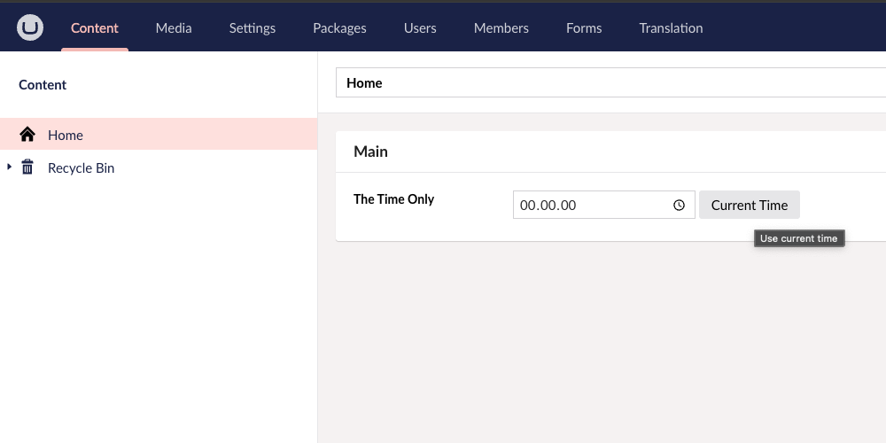

# UmbTimeOnly
A property editor for . It's basically TimeOnly from C# https://learn.microsoft.com/en-us/dotnet/api/system.timeonly?view=net-8.0

# UmbTimeOnly custom property editor.

A simple dropdown property editor for content editors for picking the time only.

It is based on .NET's [TimeOnly](https://learn.microsoft.com/en-us/dotnet/api/system.timeonly?view=net-8.0).

## Features

- **Dropdown UI** for selecting time.
- **Easy integration** into your .NET application (Code example further down)

### Usage
Though simple, this is how the inital state of the property editor:

Clicking the clock icon provides a dropdown that let's you select the time.

If you want to use the current time, you can click the button with that name to get it right away. \
This shows the property editor before clicking Current Time:

This shows the property editor after clicking Current Time:

#### Code example
An example of how to use this property editor in code. \
Here we check if the time is before or after the time that is picked in the editor:

Having picked 12:11:31 this is the output:
